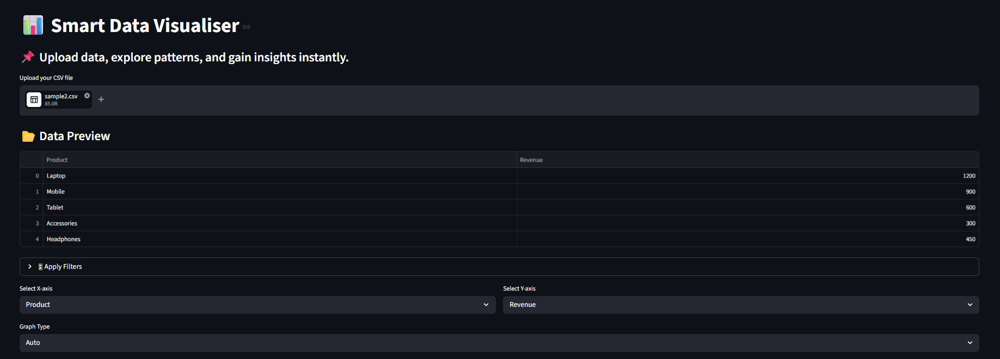
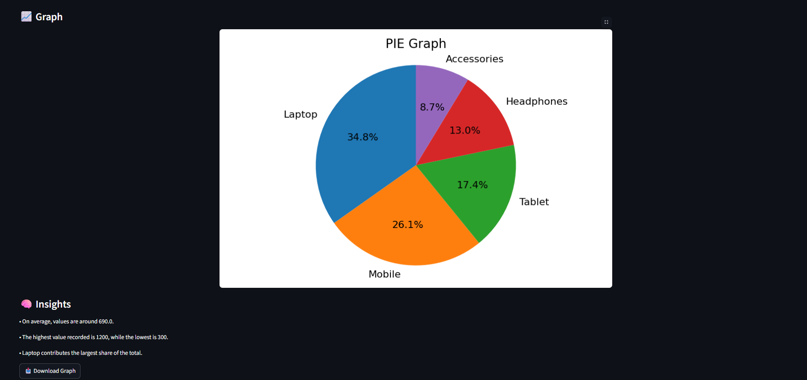

# 📊 Smart Data Visualiser

An intelligent data visualization tool that automatically selects the most appropriate graphs and generates meaningful insights from raw CSV datasets.

Built using Python and Streamlit, this project focuses on making data exploration intuitive, efficient, and reliable—even for real-world datasets.

---

##  Live Capabilities

- Upload any CSV dataset  
- Automatically generate appropriate visualizations  
- Apply dynamic filters to refine data  
- Analyze relationships using correlation heatmaps  
- Generate quick statistical insights  
- Export graphs as images  

---

##  Key Features

###  Smart Graph Selection
The system automatically determines the best visualization based on:
- Data type (categorical vs numeric)  
- Number of unique values (cardinality)  
- Dataset size  
- Type of analysis (distribution vs relationship)  

###  Supported Visualizations
- Bar Chart (categorical comparison)  
- Line Chart (trend visualization)  
- Pie Chart (only for small datasets)  
- Scatter Plot (numeric relationships)  
- Histogram (distribution analysis)  
- Correlation Heatmap (multi-variable relationships)  

###  Interactive Filtering
- Apply range filters on numeric columns  
- Dynamically update graphs based on filtered data  

###  Insight Generation
Automatically provides:
- Mean, minimum, and maximum values  
- Distribution observations  
- Correlation hints  
- Context-aware summaries  

###  Export
- Download generated graphs as PNG files  

---

##  Graph Selection Strategy

| Data Scenario            | Selected Graph                       |
|--------------------------|--------------------------------------|
| Same numeric column      | Histogram                            |
| Numeric vs Numeric       | Scatter Plot                         |
| Few categories (≤5)      | Pie Chart                            |
| Moderate categories      | Bar Chart                            |
| Large datasets           | Avoids Pie Charts (uses Bar/Scatter) |

> **Principle:** The goal is clarity, not just visualization.

---

## 🛠 Tech Stack

- **Python**  
- **Streamlit** – UI & interactivity  
- **Pandas** – Data processing  
- **Matplotlib** – Core plotting  
- **Seaborn** – Heatmap visualization  

---

## 📂 Project Structure

```
smart-data-visualiser/
├── app.py
├── utils/
│   ├── data_loader.py
│   ├── graph_generator.py
│   ├── insights.py
├── requirements.txt
└── README.md
```


---

## ▶️ Getting Started

### 1. Clone the Repository

```bash
git clone https://github.com/anahitashrestha/Smart-Data-Visualiser.git
cd Smart-Data-Visualiser
```

### 2. Install Dependencies

```bash
pip install -r requirements.txt
```

### 3. Run the Application

```bash
streamlit run app.py
```

### 4. Open in Browser

```text
http://localhost:8501
```

---

## 📸 Demo

### Dashboard View



### Graph & Insights



---

##  Example Use Cases

- Employee salary analysis  
- E-commerce sales insights  
- Student performance evaluation  
- Time-series trend analysis  
- Correlation analysis between variables  

---

##  Limitations

- Supports only CSV files  
- Insights are rule-based (not ML-driven)  
- Extremely large datasets may affect performance  

---

##  Future Improvements

- Excel (.xlsx) support  
- Machine learning-based insights  
- Time-series detection  
- Outlier detection  
- Cloud deployment (Streamlit / AWS)  

---

##  What Makes This Project Stand Out

- Not just plotting → decision-driven visualization  
- Handles real-world datasets intelligently  
- Prevents misleading visualizations (like large pie charts)  
- Clean separation between visualization and analysis  

---

##  Author

Anahita Shrestha  

---

## 📌 Note

This project was developed as part of coursework in Data Science, focusing on practical implementation of intelligent data visualization techniques.
=======

